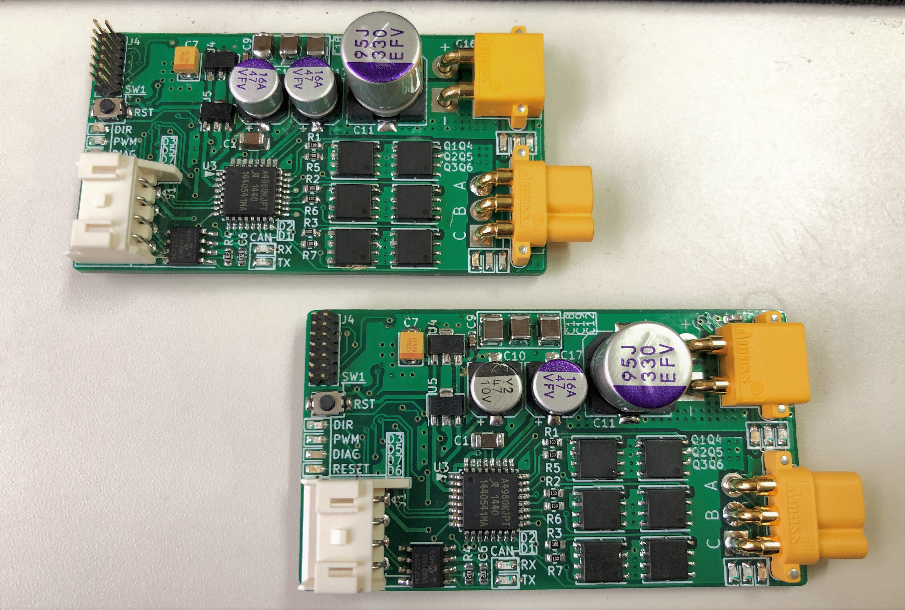

  

# センサレスブラシレスDCモータドライバー用ファームウェア

A4960とSTM32を使用したセンサレスBLDCモータドライバに書き込むファームウェア。

BEMFによるゼロクロスを検出することでモータのローター位置を特定し制御を行います。

## 入力方法

このモータドライバはCAN通信に対応しています。
FreeRTOS上のタスク`StartBLDCTask();`で呼び出されている`CAN_Filter_Init(id1,id2,id3,id4);`の引数を変更することで任意のCANIDに変更することが可能です。

現時点では、CANデータフレーム内の7、8バイト目のデータをMSBの符号付整数型としてモータドライバーの出力値として受け取り、出力します。

## データ出力

CANメッセージID`0x05`として、ゲートドライバA4960から生成されたTACHOパルスを計測した値を発行します。メッセージの送信周期はFreeRTOSのTickに影響されます。（デフォルトで1000Hz）

## ファームウェアの書き換え

ファームウェアを書き換える際は、基板左上のコネクタと横向き4ピンXAの裏についているUSB MicroBを用いて行います。（MicroBは電源供給用。XAコネクタからの供給でも可。）

基板に電源ケーブルを接続した後、ST-Linkをケーブルが基板の外側を向くように接続します。

ファームウェアの書き込みにはSWDを使用します。
